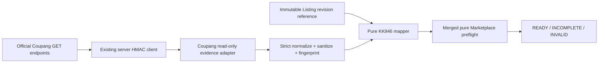

# Architecture Story: Coupang Read-only Preflight Evidence v1

## 1. Decision status

- Status: proposed; repository-owner approval required before implementation.
- Date: 2026-08-08.
- Owner: Coupang adapter for acquisition; Listing domain for normalized
  preflight consumption.
- Dependency: Coupang Seller Product Contract Audit v1 and merged Marketplace
  Product Creation preflight PR #110.
- Risk: normal-risk documentation and contract tests. Runtime implementation
  is separately admitted only after this Story is accepted.
- External writes, Product Creation, Production data mutation, database,
  migration, Auth/RLS, new secrets, and paid actions: none.

## 2. Business objective and revenue gate

KK946 cannot reach a meaningful local Product Creation preflight until the
selected category, outbound location, and return center are proven against the
same seller boundary. Free-text codes are not evidence. The shortest safe path
to a first listing is a bounded read-only evidence adapter that converts three
official Coupang GET responses into a sanitized, fingerprinted envelope for
the merged pure preflight.

Success means the system can say `READY`, `INCOMPLETE`, or `INVALID` using
fresh evidence without claiming Coupang acceptance. It does not mean KK946 has
the required product facts, rights-cleared assets, price, stock, or owner
authorization for a marketplace write.

## 3. Current-state evidence and root cause

Root-cause class: code and external-contract gap, not database failure.

- `lib/coupang/client.ts` already owns server-side HMAC signing and the three
  existing `COUPANG_*` configuration values.
- `lib/coupang/category.ts` already performs metadata and validity GETs, but
  returns generic raw provider envelopes.
- no repository adapter queries outbound or return locations;
- `app/api/coupang/categories/meta` can return provider `raw` details and is
  not an approved evidence boundary;
- merged preflight PR #110 already requires a category snapshot and
  vendor-scoped outbound/return code evidence;
- persisting provider responses in `listing_drafts` or registration attempts
  would mix mutable provider data, addresses, phone numbers, fees, and errors
  with product intent and is prohibited by this Story.

The implementation must not compensate for missing Coupang credentials,
seller assignment, provider availability, or Wing location setup by inventing
codes or marking a product invalid.

## 4. Official contract evidence

Observed 2026-08-08 from official Coupang documentation:

1. [Category Metadata Query](https://developers.coupang.com/en/api/categories/category-metadata-query):
   `GET /v2/providers/seller_api/apis/api/v1/marketplace/meta/category-related-metas/display-category-codes/{displayCategoryCode}`
   owns attributes, notices, required documents, certifications, allowed
   conditions, and single-item allowance.
2. [Query a shipping location](https://developers.coupang.com/en/api/logistics/query-a-shipping-location):
   `GET /v2/providers/marketplace_openapi/apis/api/v2/vendor/shipping-place/outbound`.
   It supports exact `placeCodes` lookup and list paging; `pageSize` is at most
   50. Responses also contain address/contact fields that are not required by
   this evidence contract.
3. [Query a list of return locations](https://developers.coupang.com/en/api/logistics/query-a-list-of-return-locations):
   `GET /v2/providers/openapi/apis/api/v5/vendors/{vendorId}/returnShippingCenters`.
   It is vendor-scoped and supports `pageNum`/`pageSize` up to 50. Responses
   contain courier, fee, and error fields that are not required here.
4. [Product Creation](https://developers.coupang.com/en/api/products/product-creation)
   requires category, shipping/return, notices, options, and other category-
   compliant data. It is POST and remains outside this Story.

Official pages are mutable. Every normalized evidence result records the
exact source URL, observation time, schema/ruleset version, selected identity,
and canonical digest. Unknown provider shapes fail closed.

## 5. Scope and non-goals

In scope after approval:

- strict decoders for the three read-only response families;
- server-only typed adapters using the existing Coupang client/configuration;
- exact category and outbound-code lookup plus bounded return-code discovery;
- normalized evidence with canonical SHA-256 fingerprints;
- a pure KK946 adapter that combines an immutable Listing revision reference,
  selected codes, normalized evidence, and the existing preflight;
- sanitized observability and synthetic official-shape fixtures.

Non-goals:

- public API or browser exposure of seller evidence;
- new environment variables, secrets, OAuth, Wing login, or key issuance;
- location create/update, asset upload, Product Creation, approval request,
  price, stock, order, fulfillment, return operation, or any other write;
- database/schema/migration/RLS/Auth or persistence of raw/normalized evidence;
- automatic category, outbound location, return center, product fact, asset,
  certification, notice, document, price, or SKU selection;
- Rocket Growth or Hybrid support;
- proving Coupang acceptance or KK946 readiness.

## 6. Ownership and dependency direction



The Coupang adapter owns transport, provider decoding, and sanitization. The
Listing domain owns evidence consumption and preflight disposition. The mapper
must not import HTTP, environment, Supabase, or filesystem modules. Routes and
UI must not call the new adapter in this implementation Story.

## 7. Read-only command boundary

The adapter exposes only these internal operations:

```ts
type CoupangEvidenceReader = Readonly<{
  readCategory(input: {
    displayCategoryCode: string;
    evaluatedAt: string;
  }): Promise<CategoryEvidenceReadResult>;
  readOutbound(input: {
    vendorRef: string;
    outboundShippingPlaceCode: string;
    evaluatedAt: string;
  }): Promise<OutboundEvidenceReadResult>;
  readReturnCenter(input: {
    vendorRef: string;
    returnCenterCode: string;
    evaluatedAt: string;
  }): Promise<ReturnEvidenceReadResult>;
}>;
```

- HTTP method is fixed to `GET` in each operation.
- Host remains `api-gateway.coupang.com` through the existing client.
- Category and outbound requests use the exact selected code.
- Return lookup begins at page 1 with `pageSize=50`, follows only validated
  integer pages, stops when the exact code is found, and is capped at 10 pages
  and 500 rows by application policy. Exceeding the bound is `INCOMPLETE`, not
  product invalidity.
- redirects, alternate hosts, arbitrary paths/query keys, automatic retry,
  and POST/PUT/DELETE are prohibited.
- no call is made when input syntax or existing configuration is invalid.

## 8. Normalized evidence contracts

```ts
type EvidenceSource = Readonly<{
  observedAt: string;
  sourceUrl: string;
  schemaVersion: string;
  rulesetVersion: string;
  responseDigest: `sha256:${string}`;
}>;

type OutboundLocationEvidence = Readonly<{
  vendorRef: string;
  outboundShippingPlaceCode: string;
  usable: true;
  source: EvidenceSource;
}>;

type ReturnCenterEvidence = Readonly<{
  vendorRef: string;
  returnCenterCode: string;
  source: EvidenceSource;
}>;

type MarketplacePreflightEvidenceV2 = Readonly<{
  categorySnapshot: CoupangCategorySnapshot;
  outbound: OutboundLocationEvidence;
  returnCenter: ReturnCenterEvidence;
  evidenceFingerprint: `sha256:${string}`;
}>;
```

`vendorRef` is a server-owned opaque reference, not the access key, secret,
Wing user ID, browser session, or raw vendor ID. The adapter verifies it maps
to the currently configured vendor but never emits that mapping. Category
metadata uses the already merged strict snapshot and separate validity proof.

Only the selected code and the minimum usable/existence decision enter the
normalized envelope. Names, addresses, phone numbers, courier names, fees,
provider error messages, authorization headers, cookies, request IDs, and raw
responses are excluded.

## 9. Freshness, determinism, and disposition

- `observedAt` is captured from the injected adapter clock immediately after a
  successfully decoded response; provider data is not trusted to supply it.
- `evaluatedAt` is an injected UTC instant, never read implicitly by pure code.
- category and logistics evidence older than seven days is `INCOMPLETE`,
  matching the merged preflight policy.
- canonical JSON uses sorted object keys, NFC strings, finite numbers, bounded
  arrays, and SHA-256. Input ordering that has no semantic meaning is sorted
  before hashing.
- identical normalized evidence produces an identical fingerprint.
- `READY` requires all three evidence components to share the selected codes
  and server-owned vendor reference and to satisfy freshness.
- absence, unavailable configuration/provider, page-cap exhaustion, or stale
  evidence is `INCOMPLETE`; malformed shape, identity/code mismatch, duplicate
  contradictory records, or impossible values is `INVALID`.

## 10. Failure taxonomy

| Failure | Classification | Product disposition | Retry |
|---|---|---|---|
| missing existing Coupang config | `CONFIGURATION_UNAVAILABLE` | `INCOMPLETE` | after owner config verification |
| DNS/timeout/network | `NETWORK_UNAVAILABLE` | `INCOMPLETE` | operator-triggered only |
| 401/403 | `AUTHENTICATION_OR_SCOPE` | `INCOMPLETE` | no automatic retry |
| 429 | `RATE_LIMITED` | `INCOMPLETE` | no automatic retry in v1 |
| provider 5xx | `PROVIDER_UNAVAILABLE` | `INCOMPLETE` | no automatic retry in v1 |
| unknown/malformed success | `RESPONSE_CONTRACT_ERROR` | `INVALID` evidence | no retry until contract review |
| selected code absent | `EVIDENCE_NOT_FOUND` | `INCOMPLETE` | after Wing/source verification |
| duplicate contradictory code | `EVIDENCE_CONFLICT` | `INVALID` | manual resolution |
| stale observation | `EVIDENCE_STALE` | `INCOMPLETE` | one new owner-triggered read |

Transport/configuration failure must never be reported as a defective KK946
product. No exception or log may include provider raw content or credentials.

## 11. Security and privacy

- reuse only existing server-side `COUPANG_ACCESS_KEY`, `COUPANG_SECRET_KEY`,
  and `COUPANG_VENDOR_ID`; this Story approves no configuration change;
- never accept vendor identity, credential, host, path, or HTTP method from a
  browser/client payload;
- use `cache: no-store`; no framework, CDN, browser, filesystem, or database
  cache;
- redact authorization, access key, vendor ID, Wing user, addresses, phone,
  fees, provider messages, and raw bodies before observability;
- logs contain operation, success, status class, bounded latency, sanitized
  error code, and correlation ID only;
- synthetic fixtures contain fictional IDs/addresses and no Production bytes;
- authorization/scope failures stop at the external-configuration boundary.

## 12. Idempotency, concurrency, and capacity

GET operations have no external mutation but are not assumed free or stable.
V1 performs one request chain per explicit evidence acquisition. Concurrent
deduplication and cross-request caching are excluded because they introduce a
new lifecycle. The implementation accepts an `AbortSignal`, uses the existing
transport timeout decision if present, and adds no silent retries.

One category code, one outbound code, and one return code are evaluated per
KK946 run. Return discovery is bounded to 10 requests/500 rows. Response arrays
and strings receive the existing category snapshot bounds or stricter adapter
bounds. Bulk catalog scanning is prohibited.

## 13. Cloud-first durable-state gate

| State | Owner/source of truth | Class | Retention/recovery |
|---|---|---|---|
| architecture, DTOs, tests | GitHub repository/PR | internal | Git history and branch recovery |
| official contract reference | official Coupang URLs + observed date in Git | public | re-audit on provider change |
| credentials/config | existing approved runtime secret stores | secret | never copied or changed here |
| normalized evidence | request memory only in v1 | confidential internal | reacquire; no durable copy |
| raw provider response | none | potentially confidential | discard after strict decode |
| CI evidence | GitHub Actions/Preview | internal | repository retention policy |

No new durable runtime state is created. Local fixtures are sanitized,
tracked, reproducible, and contain no provider data. Build/test/browser output
is disposable and ignored. A future persistence or cache proposal requires a
new Database/Security Architecture Story with encryption, retention, deletion,
backup, and recovery approval.

## 14. Compatibility and ordered implementation

1. Add strict normalized contracts and synthetic fixtures.
2. Add pure decoders and canonical fingerprint tests.
3. Add three server-only GET adapters using the existing client/config.
4. Add sanitized transport taxonomy and security tests.
5. Add the pure KK946 mapper to the merged preflight contract.
6. Keep every route, UI, database service, and live registration path
   unchanged.
7. Run focused/full tests, typecheck, lint, build, and existing browser checks.
8. Deliver as a normal-risk PR only if the final diff contains no configuration,
   persistence, marketplace write, or high-risk file.

Any need for new environment variables, public API, persistence, automated
schedule/retry, location mutation, Product Creation, or Production evidence
acquisition stops this implementation and requires separate approval.

## 15. Test strategy

- golden decoders for sanitized official-shape category/outbound/return data;
- negative tests for unknown keys/enums, malformed pagination, over-bounds,
  duplicate/conflicting codes, invalid Unicode, and secret-shaped material;
- exact-method/path/query tests proving only the three GET operations exist;
- security tests proving raw addresses, phones, fees, credentials, and provider
  messages never enter normalized output/logs;
- deterministic clock and fingerprint tests;
- failure mapping tests separating configuration/provider unavailability from
  product invalidity;
- KK946 mapper tests proving missing real product/asset evidence stays
  `INCOMPLETE` and no call claims acceptance;
- no live Coupang request in local, CI, Preview, or Production verification.

## 16. Rollout and rollback

Rollout ends at unused internal adapters plus synthetic tests. No route invokes
them and no evidence is persisted. A later owner-authorized read-only operator
action must identify the exact account, selected codes, purpose, and time and
must still make no write.

Rollback is a Git revert. Because there is no schema, config, persistence,
external write, or Production action, no provider or database rollback exists.

## 17. Decision requested

Repository owner acceptance authorizes only the ordered normal-risk
implementation in section 14. It does not authorize credentials/configuration,
live evidence acquisition, database work, Production, real asset use, pricing,
Product Creation, approval request, or any commerce write.

Approval evidence is the manual merge of this Architecture PR or an explicit
owner decision recorded in the Decision Log with the accepted commit SHA.
