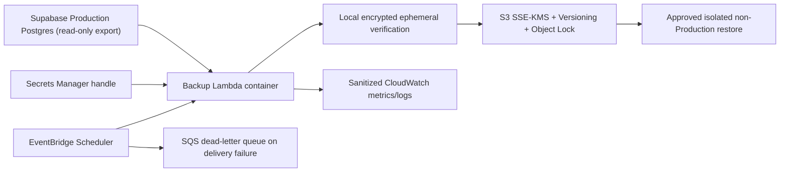

# Encrypted Cloud Backup and Restore Architecture v1

## 1. Status, authority, and risk

- Status: Architecture Story PR #91, policy PR #92, and verified Supabase Pro
  evidence PR #94 are manually merged. Deployment-order stage 3 now has a
  reviewed infrastructure plan and tests, but no AWS resource is provisioned.
- Owner: Database / Security.
- Risk: high-risk/manual because later work will access Production, introduce
  an external cloud integration and secrets, create paid resources, copy a
  Production logical archive, and eventually delete a local-authoritative
  backup.
- Machine-readable contract:
  [`encrypted-backup-contract-v1.json`](../cloud/encrypted-backup-contract-v1.json).
- Infrastructure plan/runbook:
  [`AWS-INDEPENDENT-BACKUP-INFRASTRUCTURE-PLAN-V1.md`](../cloud/AWS-INDEPENDENT-BACKUP-INFRASTRUCTURE-PLAN-V1.md).
- This Story authorizes documentation, sanitized inventory, contract tests,
  Draft PR, and Preview only.
- It does not authorize account creation, billing, resource provisioning,
  credentials, Production connection/export, backup upload, restore, local
  backup access/deletion, DB/RLS/Auth/environment changes, or PR merge.

## 2. Problem and business objective

The application source and operational database are remote, but the only
repository-recorded independently restorable logical archive remains on one
PC. Loss of that PC before an approved off-device copy exists can interrupt a
Production recovery or migration window. Feature development can continue,
but device loss remains an avoidable revenue-continuity risk.

The objective is the smallest independent, encrypted, immutable, auditable
backup path that:

1. preserves Supabase provider backups as the fastest provider-native restore;
2. creates an owner-controlled recovery copy outside the Supabase account;
3. meets the repository requirement for 35 daily recovery days and 12 monthly
   artifacts;
4. proves two clean non-Production restore cycles before local authority is
   removed; and
5. can operate without a particular PC or GitHub Actions handling raw backup
   bytes.

This work protects the shortest revenue path from device loss and unsafe
Production rollout. It does not add a customer-facing feature.

## 3. Current-state evidence and limitations

- Production database authority is Supabase project
  `sxvtznmoemrcwifungnb` in `ap-southeast-1`.
- The R3 rollout packet records a restricted PostgreSQL 17.6 custom archive,
  its SHA-256, archive-list verification, and restricted ACL outside Git.
- This Story does not open, hash again, copy, upload, or delete that archive.
  Its absolute local path is deliberately not duplicated here or in the JSON
  contract.
- A logical dump can preserve schema and rows needed for application recovery,
  but it does not by itself prove global role attributes or provider-managed
  Auth/storage state. Restore evidence must state these limits.
- Owner-supplied sanitized Dashboard evidence dated 2026-08-05 verifies that
  Production is on the Supabase Free Plan. Scheduled backups are not included,
  there is no earliest/latest managed recovery point, PITR is not enabled, and
  restore-to-new-project is not entitled.
- The Dashboard states that Pro includes up to seven days of scheduled daily
  backups. It presents PITR as a separate Pro add-on starting at USD 100/month,
  and states that restore-to-new-project requires Pro plus physical backups.
  These are displayed plan capabilities, not approved purchases.
- Subsequent owner-supplied sanitized Dashboard evidence on 2026-08-05 verifies
  that the upgrade is active: seven dated physical daily recovery points are
  visible from 2026-07-29 through 2026-08-04, each with a restore action. Spend
  Cap is enabled; PITR, Dedicated IPv4, and Custom Domain are disabled; no Log
  Drain is configured.
- Supabase explicitly warns that database backups contain Storage API metadata
  but do not include the stored objects. Independent asset backup therefore
  remains a separate future Story and is not implied by database recovery.
- Supabase documents daily backups for paid plans with plan-dependent retention
  up to 30 days and optional PITR up to 28 days. Neither alone proves the
  repository's 35-day daily plus 12-month monthly independent-retention target.
- When physical backups or PITR are active, a downloadable logical backup may
  not be available; Supabase documents `supabase db dump` or `pg_dump` as the
  logical-export path.

## 4. Decision and alternatives

### Owner-approved policy decision

Retain two complementary recovery boundaries:

1. **Provider-native:** the owner approved Supabase Pro for scheduled daily
   backups on 2026-08-05. Do not enable the PITR add-on in v1; its displayed
   starting cost is disproportionate to the initial RPO and independent-copy
   objective. Re-evaluate PITR only through a later cost/recovery decision.
2. **Independent:** create a repository-owner-controlled AWS account boundary
   in Singapore and store verified logical archives in one private S3 bucket
   using versioning, S3 Object Lock Governance mode, and a customer-managed KMS
   key. A scheduled AWS Lambda container creates the archive and manifest;
   EventBridge Scheduler invokes it. Raw backup bytes never enter CI, Vercel,
   Git, chat, or an operator download folder.

The owner also approved AWS Singapore residency, a USD 10/month AWS-only cost
ceiling, 35-day daily/12-month monthly retention, RPO <=24h, and RTO <=8h on
2026-08-05. The AWS account, bucket name, KMS key identifier, IAM roles, secret
identifier, schedule, and alarm destinations remain `null`/unprovisioned until
separately approved. Implementation must generate identifiers from reviewed
infrastructure-as-code, not copy examples from this document.

### Alternatives considered

| Alternative | Result | Reason |
|---|---|---|
| Supabase backups only | reject as sole target | same provider/account boundary and documented retention does not prove 35 daily days plus 12 monthly artifacts |
| GitHub Actions/artifacts | reject | existing policy prohibits Production backup artifacts in CI; artifact retention is engineering evidence, not disaster recovery |
| OneDrive or consumer sync | reject | explicitly prohibited as a durable authority and lacks an approved least-privilege recovery boundary |
| Manual PC upload to object storage | reject as steady state | preserves the PC dependency and invites secret/local-path drift |
| New backup SaaS | defer | adds another processor and exit contract without a demonstrated advantage for the current small PostgreSQL archive |
| AWS S3 plus scheduled Lambda | recommend | separate owner-controlled boundary, same Singapore region, managed scheduling, immutable object controls, KMS policy, and low-frequency serverless execution |

## 5. Architecture and dependency direction

- Database / Security owns the export, backup manifest, restore, and deletion
  lifecycle.
- AWS infrastructure is a new external integration and must be represented by
  reviewed infrastructure-as-code in a later implementation Story.
- Application routes, Revenue, Product, Listing, Marketplace, Workers, and
  commerce writes do not depend on this pipeline.
- Backup failure is observable and blocks risky Production rollout; it never
  changes application success responses or falls back to local durable state.

## 6. Backup object and manifest contract

Each scheduled event has one immutable `backupId`. A retry uses the same ID.
The worker must fail on an existing object whose digest/metadata differs; it
must never overwrite it or generate success from a partial upload.

The worker produces:

- one PostgreSQL custom logical archive;
- one immutable JSON manifest containing only backup ID, UTC creation time,
  source project reference, source region, PostgreSQL/`pg_dump` version,
  archive byte count, SHA-256, `pg_restore --list` result, migration-manifest
  commit/SHA, S3 object version ID, retention class, and verification status;
  and
- sanitized metrics for duration, size, success/failure class, age of latest
  verified recovery point, and restore-drill freshness.

The manifest must never contain database URLs, passwords, access tokens, JWTs,
keys, connection strings, row values, SQL dumps, object contents, customer
data, or raw exception causes. An archive is `VERIFIED` only after a successful
exit, finite non-zero size, SHA-256 generation, archive-list verification, an
S3 upload response proving the requested checksum, expected KMS encryption and
version ID, plus a separate Object Lock retain-until read-back. The scheduled
writer must not use `GetObjectAttributes`: AWS requires `s3:GetObject` (and
`kms:Decrypt` for an SSE-KMS object) for that API, which would also authorize
backup-body reads. Independent body/checksum verification therefore belongs
to the later, separately approved restore role and synthetic restore drill.

## 7. Security, privacy, and access

- Classification is `PRODUCTION_BUSINESS_DATA`; personal data may be present
  without this Story inspecting it.
- TLS is required in transit. S3 default encryption uses a customer-managed
  KMS key with S3 Bucket Keys enabled.
- S3 Block Public Access is mandatory. Bucket policies deny insecure transport,
  unencrypted writes, the wrong KMS key, non-approved prefixes, and principals
  outside the exact account roles.
- The scheduled worker has no interactive login and receives the Production
  database credential through one exact Secrets Manager resource. It can write
  and verify only its exact backup prefix; it cannot list unrelated buckets,
  read prior archive bodies, delete versions, change retention, or bypass
  Governance mode.
- A distinct restore role can read/decrypt a specifically approved object but
  cannot create/delete infrastructure or access Production.
- Operator administration requires MFA. Root credentials are not used by the
  pipeline. Account recovery factors are stored outside the development PC.
- CloudTrail records control-plane/KMS activity. CloudWatch logs remain
  sanitized and use a separately approved finite retention.
- No backup secret or data is placed in GitHub Actions, Vercel, Preview,
  repository files, Codex messages, screenshots, or support tickets.

## 8. Retention, immutability, and deletion

Proposed retention follows the accepted database baseline:

- one verified daily recovery point retained for at least 35 days;
- the first verified recovery point selected for each calendar month retained
  for at least 12 months;
- daily objects receive a 35-day Object Lock retention and monthly objects a
  365-day retention;
- lifecycle expiration can act only after the applicable lock expires; and
- the automation role never receives `s3:BypassGovernanceRetention`.

Retention, Singapore residency, and the USD 10 monthly AWS-only ceiling were
approved by the owner on 2026-08-05. The ceiling excludes the Supabase plan
upgrade. The public On-Demand AWS Pricing Calculator gate completed on
2026-08-06 with USD 2.22/month observed and USD 2.63/month 2x-stress estimates.
The binding assessment adds a fixed USD 2.00 tax and uncertainty reserve for a
USD 4.63/month planning total and USD 5.37 headroom. The sanitized inputs,
public estimate links, granularity overstatements, and conditional exclusions
are recorded in `docs/cloud/AWS-BACKUP-PRICING-ESTIMATE-V1.md`. Billing alerts
remain proposed at 50%, 80%, and 100% of the ceiling; reaching 100% alerts and
pauses nonessential retries, but never deletes a retained recovery point.

Deleting the existing local backup is a separate destructive approval after
remote parity and two-cycle restore evidence. Deletion must name the exact
target, verify the approved remote backup ID/digest, preserve required audit
metadata, and state recovery limitations.

## 9. Capacity and execution gate

AWS Lambda has a 900-second maximum runtime. The implementation Story must
measure a sanitized current logical-dump size and duration without recording
row content, then prove a bounded margin for dump, verification, upload, and
cleanup. It must stop before implementation if the approved source cannot fit
the configured encrypted ephemeral storage or finish within the approved
margin.

The owner-approved current measurement completed on 2026-08-05 with a
715,071-byte custom archive, 34.125-second dump duration, 1,251 validated
archive-list entries, and zero warnings. The transient archive and credential
were deleted, Production remained healthy, and no database or AWS write
occurred. This closes only the current dump-size/duration evidence gate.
The complete synthetic worker rehearsal succeeded on 2026-08-06. A disposable
PostgreSQL 17.6 archive of 6,351,131 bytes exceeded the required 1,430,142-byte
2x boundary and completed dump, offline inspection, SHA-256, immutable upload
contract, manifest, retention read-back, and cleanup in 7.901 seconds. Peak
ephemeral use was 6,351,837 bytes. The measured margins were 892.099 seconds
and 10,731,066,403 bytes. Production, AWS, paid usage, and scheduling were not
contacted. Lambda is therefore
`ELIGIBLE_FOR_DISABLED_WORKER_CHANGE_SET_REVIEW_ONLY`; this is not provisioning,
Production export, credential, restore, or schedule authority.

The fallback is not truncation, streaming an unverifiable partial result, or a
local cron job. It is a new Fargate architecture decision preserving the same
S3/KMS/retention contract.

The worker uses a pinned PostgreSQL client/container digest, disables core
dumps, writes only to encrypted ephemeral storage, deletes the temporary file
on every terminal path, and has no inbound network listener. A failed cleanup
is an incident signal even though Lambda later destroys the execution
environment.

## 10. Failure modes, idempotency, and observability

| Failure | Required behavior |
|---|---|
| schedule delivery fails | bounded retry, then DLQ and alarm; no invented backup |
| database/TLS/auth fails | sanitized failure, no S3 success object, preserve older backups |
| dump exceeds time/space | terminate fail-closed and require capacity re-architecture |
| archive verification fails | quarantine/no upload as verified; never delete older evidence |
| upload or KMS check fails | mark failed; immutable partial object, if any, is not eligible for restore |
| duplicate event | reconcile exact object/version/manifest; success only on exact match |
| manifest write fails after archive upload | archive remains quarantined and alarmed; no automatic delete |
| latest verified backup older than 30 hours | page owner and block material Production migrations/writes |
| retention/KMS/public-access drift | disable scheduled export and require Security review |
| restore drill fails | block local backup deletion and affected Production rollout |

No automated restore exists in v1. Production restoration is an incident action
requiring the exact backup ID, target, impact/window, verification, rollback,
and explicit owner approval.

## 11. Two-cycle restore rehearsal

After infrastructure and one Production export receive their own approvals,
run two fresh, isolated, quarantined non-Production restore cycles from the same
approved logical archive or two explicitly approved recovery points. The target
must have no Production integrations, outbound commerce access, Production app
secrets, or public ingress.

Each cycle must prove:

1. object version, KMS key, SHA-256, byte count, archive-list result, and
   manifest agree;
2. a fresh target is used rather than an already-restored database;
3. schema/object/constraint/foreign-key fingerprints and bounded row-count
   ranges match approved evidence;
4. canonical text and generated digest samples reproduce without exposing
   values;
5. known logical-dump limitations, including global roles and provider-managed
   services, remain explicit;
6. no Production/marketplace/provider integration is reachable;
7. the full elapsed recovery time is within the owner-approved RTO;
8. temporary restore state is destroyed or quarantined through the approved
   provider procedure; and
9. the second cycle yields the same sanitized fingerprints.

Only sanitized evidence identifiers and digests enter GitHub. Raw backup,
restored rows, database connection material, and provider credentials do not.

## 12. Deployment order and rollback

Every numbered stage is a separately reviewed high-risk action unless stated:

1. manually accept and merge this Architecture Story;
2. record the verified Supabase Free/no-managed-backup state and the approved
   Pro daily backups, Singapore residency, AWS billing ceiling, retention, and
   RPO/RTO; separately verify AWS account, billing method, MFA, and recovery
   ownership;
3. implement reviewed infrastructure-as-code and contract tests without
   Production credentials or enabled schedule (**implemented in repository;
   not provisioned**);
4. provision the isolated AWS boundary with schedule disabled;
5. verify IAM/KMS/S3/Object Lock/alerts using synthetic data only;
6. approve the exact Production export identity and secret injection;
7. perform one bounded export and verify the immutable remote artifact;
8. execute and approve two fresh restore cycles;
9. enable the daily schedule and observe at least two successful cycles;
10. only then propose exact local-backup deletion.

Architecture rollback is a documentation revert. Before Production export,
infrastructure rollback disables the schedule and removes only empty/synthetic
resources through an approved plan. After an immutable Production object
exists, do not destroy the KMS key, bucket, retained object, manifest, or audit
trail as an ordinary rollback. Disable new writes, preserve evidence, and use a
separately approved retention/decommission procedure.

## 13. Owner decisions and physical work

The following cannot be completed by repository code and must be performed or
explicitly approved by the owner before provisioning:

1. **Completed 2026-08-05:** the owner inspected Production **Database >
   Backups** and supplied sanitized evidence. The verified state is Free Plan,
   no scheduled backup, no retained recovery point, PITR not enabled, and no
   restore-to-new-project entitlement. No credential or backup content was
   supplied.
2. **Completed and verified 2026-08-05:** Supabase Pro is active with seven
   physical daily recovery points and visible restore actions. Spend Cap is
   enabled; PITR remains disabled. Official pricing at the decision date is
   from USD 25/month. Exact invoice/tax evidence remains private billing data
   and is not stored in this repository.
3. **Completed 2026-08-05:** an owner-controlled Paid AWS account has
   a registered payment method, one root MFA device, a recurring USD 10 Budget,
   and selectable Singapore region. Account identifiers remain private and no
   access key was requested. Account-recovery contacts and an independent
   recovery method are owner-verified. A second root MFA factor remains
   optional and is not a v1 gate.
4. **Approved 2026-08-05:** `ap-southeast-1` residency, USD 10/month AWS-only
   initial ceiling, 35-day daily/12-month monthly retention, RPO <=24h, and RTO
   <=8h.
5. The infrastructure plan was manually merged through PR #95 and the capacity
   packet through PR #96. The first Production measurement failed closed at
   credential authentication and the second attempt lost final result evidence
   in transport. After adding independent sanitized-result persistence, the
   owner-approved third and final attempt succeeded on 2026-08-05: 715,071
   bytes, 34.125 seconds, 1,251 archive-list entries, and zero warnings.
   Cleanup and Production health passed. All three one-attempt approvals are
   consumed. On 2026-08-06, the public On-Demand AWS Pricing Calculator
   recorded USD 2.22/month observed and USD 2.63/month 2x-stress estimates in
   Singapore. A fixed USD 2.00 tax/uncertainty reserve yields a USD 4.63/month
   binding assessment, below the USD 10 ceiling. The synthetic complete-worker
   rehearsal then passed the accepted runtime and ephemeral-storage margins.
   The exact disabled-worker CloudFormation change set still needs separate
   approval; provisioning and the first Production upload remain later gates.
6. Approve the restore rehearsal and, only after parity, the exact local
   backup deletion.

Do not send passwords, access keys, database URLs, recovery codes, or MFA
secrets through GitHub or Codex. A successful console check is reported only as
sanitized metadata.

## 14. Acceptance and remaining non-goals

Manual merge accepts the architecture and the ordered decision packet only. It
does not create an AWS/Supabase resource, accept charges, create a credential,
authorize Production access/export/restore, approve a retention deletion, or
waive any later manual gate.

Product assets, Orchestrator ledger migration, provider-managed Auth/storage
recovery, cross-region replication, cross-account replication, legal-hold
policy, customer data erasure reconciliation, and full business continuity are
separate Stories.

## 15. Official references

- [Supabase Database Backups](https://supabase.com/docs/guides/platform/backups)
- [Supabase Pricing](https://supabase.com/pricing)
- [Supabase subscription management](https://supabase.com/docs/guides/platform/manage-your-subscription)
- [Supabase cost controls](https://supabase.com/docs/guides/platform/cost-control)
- [Supabase logical backup download guidance](https://supabase.com/docs/guides/troubleshooting/download-logical-backups)
- [Amazon S3 pricing](https://aws.amazon.com/s3/pricing/)
- [Amazon S3 Object Lock](https://docs.aws.amazon.com/AmazonS3/latest/userguide/object-lock.html)
- [Amazon S3 default encryption](https://docs.aws.amazon.com/AmazonS3/latest/userguide/bucket-encryption.html)
- [AWS Lambda timeout](https://docs.aws.amazon.com/lambda/latest/dg/configuration-timeout.html)
- [AWS Lambda encryption at rest](https://docs.aws.amazon.com/lambda/latest/dg/security-encryption-at-rest.html)
- [EventBridge Scheduler management](https://docs.aws.amazon.com/scheduler/latest/UserGuide/managing-schedule.html)
- [AWS KMS pricing](https://aws.amazon.com/kms/pricing/)
- [AWS Pricing Calculator getting started](https://docs.aws.amazon.com/pricing-calculator/latest/userguide/getting-started.html)
- [AWS Pricing Calculator estimate sharing](https://docs.aws.amazon.com/pricing-calculator/latest/userguide/save-share-estimate.html)
