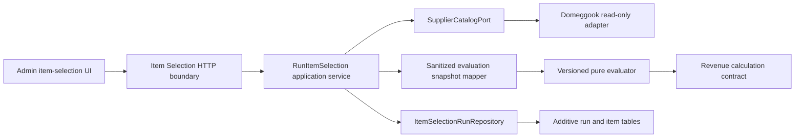
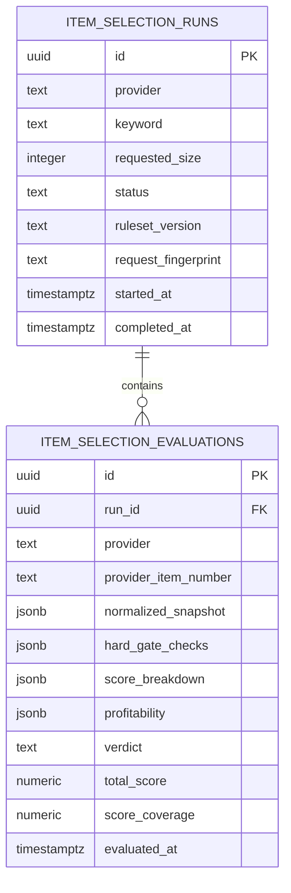

# Architecture Story: Item Selection Evaluation v1

> Asset acquisition/evaluation consumers must apply
> [Asset Error Isolation and Pipeline Continuity Policy v1](ASSET-ERROR-ISOLATION-AND-PIPELINE-CONTINUITY-POLICY-V1.md): an asset failure is item-scoped, but no blocked asset can satisfy the image-rights hard gate.

## 1. Approval status

- Status: approved by the repository-owner directive dated 2026-07-27
- Owner: Supplier / Procurement, with Revenue as the financial-rule owner
- Baseline: `origin/main` at
  `81a2a7ab55ec3d041de895ff337650328f717cd9`
- Story type: architecture and decision only
- Delivery risk: normal-risk while the diff remains documentation-only
- Runtime, database, migration, environment, and Production changes: none

This Story approves an implementable boundary. It does **not** claim that item
evaluation, recommendation, persistence, API, or UI exists in Production.
Financial code, schema, RLS/auth, and Production changes remain separately
classified and approved work.

## 2. Objective, impact, and evidence

The objective is the smallest reliable path from a bounded, real supplier
search to an explainable operator decision. It should reduce manual candidate
screening while preventing unknown resale rights, image rights, evidence, or
costs from being presented as safe or profitable.

Current evidence:

- PR #33 approved the bounded, no-persistence Domeggook Live Search contract.
- PR #34 implemented `GET /api/integrations/domeggook/search` through
  `SupplierCatalogService`; it remains read-only.
- `SupplierCatalogPort` exposes bounded `searchItems` and `getItem`.
- The normalized supplier item currently contains identity, name, supplier
  price, shipping fee, MOQ, stock, safe URLs, supplier identity, and two
  availability flags. It does not prove resale, image-use/editing rights, or
  tax-invoice eligibility.
- `calculateProductRevenue` is the repository source of truth for KRW
  contribution-profit semantics, rounding, missing inputs, and invalid inputs.
  It is Product-shaped today, so a later adapter may reuse the engine contract;
  this Story does not duplicate its formulas.
- Existing discovery, decision, sourcing, and revenue tables do not preserve
  the supplier snapshot, five independent hard gates, ruleset coverage, and
  run-level partial failure required here. Reusing them would overload their
  lifecycle and defaults.
- The repository has no verified admin authentication/authorization boundary.
  Existing permissive database policies are known debt, and the authoritative
  fresh-replay baseline remains a separate prerequisite.

Root-cause class: capability and architecture gap. This is not a provider
configuration failure and must not be compensated for in the legacy route.

## 3. Decision and boundaries

Create an Item Selection application use case owned by Supplier / Procurement.
It orchestrates provider-neutral catalog reads, a pure versioned Item Selection
policy, the Revenue calculation contract, persistence, and presentation.



Responsibilities:

| Boundary | Owns | Must not own |
|---|---|---|
| Provider adapter | authenticated bounded reads, provider DTO parsing, provider-neutral catalog mapping | GonggamLine scores, verdicts, persistence |
| Application service | deduplication, bounded enrichment, orchestration, transaction coordination, run status | formulas or HTTP serialization |
| Item Selection policy | hard gates, coverage, score, verdict, deterministic ordering, explanation templates | network, database, LLM |
| Revenue | money validation, KRW rounding, contribution profit and margin | supplier-rights gates or recommendation prose |
| Persistence | immutable run/item snapshot storage and retrieval | recalculating old results |
| HTTP | admin auth, validation, rate limit, idempotency, DTO mapping, safe errors | provider parsing or business decisions |
| UI | accessible run, list, filters, detail, evidence, missing-fact presentation | recomputing policy |

### Preserved Live Search contract

The existing Live Search route and adapter remain read-only and unchanged.
They acquire no database import, evaluation call, recommendation, or hidden
write. Provider credentials stay server-only and are absent from domain,
snapshot, log, and public DTOs.

All new writes originate only from `RunItemSelection` through
`ItemSelectionRunRepository`. The legacy `/api/domeggook-search` remains
quarantined and is not reused.

## 4. Execution model

v1 uses a bounded synchronous application request for exactly `10`, `20`, or
`30` list results. It performs one bounded list search, deduplicates by
`(provider, providerItemNumber)`, and may request details only when an approved
normalized fact is absent and the shared workflow deadline permits it.

The implementation must set one request-wide deadline below the verified
hosting limit, retain adapter concurrency at no more than four, stop launching
detail calls when the deadline budget cannot accommodate them, and convert
unfetched facts to missing facts. It must not execute 30 unbounded sequential
detail requests. Deadline exhaustion after a successful list produces
`PARTIAL`, not invented evidence.

This choice avoids a new Queue before the synchronous capacity is measured.
If Preview size-30 p95 or timeout evidence cannot meet the verified platform
limit with safety headroom, implementation of the run API stops. A separate
Queue/Lifecycle Architecture Story must then reuse the existing Runtime Queue
principles; no new SaaS is introduced implicitly.

Rejected alternatives:

- Adding evaluation to Live Search: violates the approved no-write contract.
- Reusing the legacy Domeggook route: combines invented economics and Product
  persistence.
- Treating all list-only candidates as evaluated: missing policy facts would
  be hidden.
- Introducing a queue now: capacity evidence does not yet justify the new
  lifecycle and the database/auth prerequisites are unresolved.

## 5. Domain contract

### EvaluationRun

`id`, `provider`, normalized `keyword`, `requestedSize`, `receivedCount`,
`evaluatedCount`, `succeededCount`, `failedCount`, `status`, `startedAt`,
`completedAt`, sanitized `errorSummary`, `rulesetVersion`, `requestedBy`,
`requestFingerprint`, and audit timestamps.

`status` is `RUNNING | COMPLETED | PARTIAL | FAILED`.

### ItemEvaluation

`runId`, `provider`, `providerItemNumber`, sanitized immutable
`normalizedSnapshot`, `hardGateChecks`, `scoreBreakdown`, `totalScore`,
`scoreCoverage`, `profitability`, `verdict`, `recommendationReasons`, `risks`,
`missingFacts`, `evidence`, `evaluatedAt`, `rulesetVersion`, and
`evaluatorVersion`.

### Enumerations

- `HardGateStatus`: `PASS | FAIL | UNKNOWN | NOT_APPLICABLE`
- `Verdict`: `RECOMMEND | CONDITIONAL | MANUAL_REVIEW | REJECT`
- Score area state: `AVAILABLE | UNAVAILABLE`

Evidence contains a stable source-field/type, human-readable summary, observed
time, and safe provider URL or internal reference. It never contains a raw
provider payload, full HTML, binary image, API key, Authorization header,
cookie, or stack trace.

Invariants:

- `(runId, provider, providerItemNumber)` is unique.
- Every item and run identifies the exact ruleset.
- Historical reads return stored decisions and snapshots; they never
  recalculate with the current ruleset.
- A later replay creates a new run linked by an optional `supersedesRunId`.
- Money uses integer KRW at the domain boundary and `numeric(14,2)` storage;
  JavaScript floating-point money is not authoritative.

## 6. Ruleset `gonggamline-item-selection-v1`

The ruleset is immutable after release. A semantic change creates a new
version; label-only presentation changes may change the evaluator version
without changing the ruleset.

### Hard-gate decision table

No current `SupplierCatalogItem` field alone proves the five gates. An
implementation may add provider-normalization facts only after fixture-backed
provider contract verification. Absence is `UNKNOWN`, never `PASS`.

| Gate | PASS evidence | FAIL evidence | UNKNOWN | N/A |
|---|---|---|---|---|
| Resale/channel permission | explicit supplier/provider term allows the intended marketplace and no conflicting restriction | explicit marketplace/channel prohibition, resale prohibition, or binding price restriction the run violates | no explicit evidence, ambiguous wording, or unavailable detail | only when an approved policy proves the intended channel is outside the restriction; reason required |
| Intellectual-property risk | verified generic/unencumbered source evidence and no identified third-party claim | explicit infringement/prohibition/rights-holder notice or verified restricted brand/character/design evidence | keyword match alone, unclear brand ownership, or missing rights evidence | not permitted in v1 |
| Image use permission | explicit permission covering marketplace reuse for the identified images | explicit reuse prohibition, third-party logo/watermark, or rights-holder restriction | image URL exists but rights are unstated/ambiguous | only when the run explicitly excludes using supplier images; reason required |
| Image editing permission | explicit permission covers the intended crop/text/background/composition operations | explicit editing/derivative-work prohibition | use permission without editing scope, or no evidence | only when no image modification is intended and policy records that constraint |
| Tax invoice/evidence | explicit tax-invoice eligibility or verified transaction-evidence statement from supplier/provider | explicit ineligibility | no statement, ambiguous seller status, or detail failure | not permitted in v1 |

Each gate stores status, reason code, evidence references, and missing facts.
One `FAIL` forces `REJECT`. With no `FAIL`, any required `UNKNOWN` caps the
verdict at `MANUAL_REVIEW`. `NOT_APPLICABLE` requires a ruleset reason code.
An LLM cannot add evidence or change a gate.

### Score and coverage

No approved Item Selection weights existed. v1 approves:

| Area | Weight |
|---|---:|
| Competitiveness | 45 |
| Profitability | 25 |
| Demand | 10 |
| Conversion potential | 8 |
| Logistics fit | 7 |
| Supply stability | 5 |
| Total | 100 |

Each area defines a normalized `0..100` score only from verified inputs. Its
contribution is `normalizedScore * weight / 100`. Unavailable areas contribute
no synthetic zero or neutral score and are marked `UNAVAILABLE`.

```text
availableWeight = sum(weight for AVAILABLE areas)
availableDataScore =
  sum(area contribution) / availableWeight * 100
scoreCoverage = availableWeight / 100
totalScore = availableDataScore only when scoreCoverage = 1; otherwise null
```

Both `availableDataScore` and `scoreCoverage` are displayed. `totalScore` is
comparable for verdict thresholds only at 100% coverage. This prevents a high
partial score from hiding low coverage.

Input rules:

- Competitiveness requires an approved competition analysis; supplier search
  rank or keyword frequency is not a competition metric.
- Profitability requires a ready/estimated Revenue result and approved minimum
  thresholds.
- Demand requires measured demand with provenance and freshness.
- Conversion potential requires measured conversion evidence; title/image
  opinion is not a substitute.
- Logistics fit may use verified size/weight/handling data and explicit cost.
- Supply stability requires longitudinal or contractual evidence; a current
  in-stock flag alone is insufficient.

No Coupang search volume, competitor count, advertising cost, or conversion
rate is generated when absent.

### Profitability contract

The implementation adapts candidate inputs into the existing Revenue
Calculation contract and does not duplicate its formula. Sources are:

| Value | Source |
|---|---|
| supplier unit cost, supplier shipping, MOQ | sanitized provider snapshot |
| candidate selling price | fresh confirmed identical-product delivered market evidence with the same sellable unit count |
| fee amount/rate, advertising, logistics, packaging, return reserve, VAT treatment | approved system setting with version/provenance or explicit run input |

Outputs are expected revenue per unit, supply cost, marketplace fee,
logistics/shipping, advertising, other reserve, contribution profit,
contribution margin, break-even selling price, assumptions, and missing fields.
KRW rounds to the nearest won and margin to one decimal, matching the Revenue
contract. VAT follows the approved Revenue setting; this Story invents none.

No proposed sale price means profitability is `incomplete`. Missing fee,
logistics, advertising, return, or tax treatment is not silently zero unless an
approved versioned setting explicitly supplies zero. Any missing core input
means “profitability not confirmed” and caps the verdict at `MANUAL_REVIEW`.
The repository has no approved minimum profit/margin for this use case, so
`RECOMMEND` remains unavailable until the owner supplies those versioned
thresholds in a separate high-risk Revenue policy Story.

#### Pre-purchase eligibility amendment

An arbitrary proposed price is insufficient for procurement. Before any sample
purchase can be considered, the Revenue-owned gate must evaluate the fresh
confirmed delivered price of an identical product with the same unit count,
apply all mandatory and conservative variable costs, and pass the recommend
profit and stress thresholds. The requested sample quantity must equal the
verified supplier MOQ. Missing, stale, comparable-only, or mismatched evidence
fails closed as `INCOMPLETE`; a below-threshold market-price scenario is
`FAIL`.

`PASS` means eligible for separate purchase review, not authorized to order or
pay. Until a trusted persisted gate result is bound to the Procurement write
path in a separately approved high-risk Story, `sourcing_decisions` alone must
not be used as purchase authority.

### Verdict and ordering

1. Any hard-gate `FAIL` -> `REJECT`.
2. Otherwise any required `UNKNOWN`, incomplete profitability, incomplete
   coverage, or absent minimum-profit policy -> `MANUAL_REVIEW`.
3. Once thresholds are approved: gates pass, full coverage, score at least 75,
   and profit/margin thresholds pass -> `RECOMMEND`.
4. Once thresholds are approved: gates pass, full coverage, score at least 60
   but a non-hard recommendation criterion misses -> `CONDITIONAL`.
5. Otherwise -> `REJECT`.

Sort buckets are `RECOMMEND`, `CONDITIONAL`, `MANUAL_REVIEW`, `REJECT`.
Within a bucket: non-null `totalScore` descending (null last), non-null
contribution margin descending (null last), provider item number ascending by
numeric value when both are canonical digits and otherwise Unicode code-point
order, then original deduplicated position.

Deterministic Korean explanation templates are the default. An optional LLM may
only paraphrase stored reasons/risks or propose operator questions through
structured output, timeout, and fallback. Its output is separately labeled and
cannot change snapshots, evidence, numbers, scores, gates, or verdict.

## 7. Persistence contract

Existing recommendation and decision tables are not reused. A later additive
migration proposes:



Candidate constraints/indexes:

- checks for run status, verdict, requested size, `0..100` score, and `0..1`
  coverage;
- unique `(run_id, provider, provider_item_number)`;
- unique partial index on active `request_fingerprint` for duplicate
  protection;
- indexes `(started_at desc, id desc)`, `(run_id, verdict, total_score desc)`,
  and the item foreign key;
- `ON DELETE CASCADE` from run to its evaluations; no Product foreign key;
- explicit requester/audit identifier whose type follows the approved auth
  model, not an invented user relationship.

JSON is used for immutable, version-shaped snapshots and evidence, with
application schema validation and response-size caps. Frequently filtered
state remains typed columns. Whole raw payloads are forbidden.

Transaction boundary:

1. insert `RUNNING` run after validated/admin-authorized input;
2. read provider outside a long database transaction;
3. atomically insert all completed item snapshots and finalize counters/status;
4. if finalization fails, return failure and leave a recoverable `RUNNING` run
   for stale-run reconciliation; never report success.

Retention defaults to preservation until an approved data-retention policy is
defined. Cleanup is a separate audited operation. Additive tables are not
dropped during application rollback.

Migration implementation is blocked until the database baseline and concrete
admin identity/RLS policy are approved. It is high-risk, receives
`manual-merge-required`, is rehearsed on a disposable database, then applied
Preview before Production with schema-cache verification.

## 8. HTTP contract

Proposed routes:

- `POST /api/item-selection/runs`
- `GET /api/item-selection/runs?cursor=<opaque>&limit=<1..50>`
- `GET /api/item-selection/runs/:id`

`POST` accepts:

```json
{
  "provider": "DOMEGGOOK",
  "keyword": "차량용 테이블",
  "size": 20,
  "proposedSalePriceKrw": 29900,
  "costProfileVersion": "owner-approved-version"
}
```

Only `provider`, `keyword`, and `size` are structurally required;
`size` is exactly `10 | 20 | 30`. Missing financial inputs remain visible and
produce `MANUAL_REVIEW`, not a validation success disguised as profitability.

Successful POST returns `201` with the stored run summary and ordered item
DTOs. A matching active request fingerprint returns `409
DUPLICATE_RUN_ACTIVE` plus the safe existing run id. The fingerprint is a
server-side hash of requester scope, provider, normalized keyword, size,
financial input/version, and ruleset; a completed run is never silently reused.

List uses opaque keyset pagination and compact summaries. Detail is capped to
30 items and bounded evidence/reason arrays. Stable errors include
`VALIDATION_FAILED` (400), `AUTHENTICATION_REQUIRED` (401),
`FORBIDDEN` (403), `DUPLICATE_RUN_ACTIVE` (409), `RATE_LIMITED` (429),
`PROVIDER_UNAVAILABLE` (502/503), and `INTERNAL_ERROR` (500). Error bodies are
sanitized and use the repository response envelope at implementation time.

All routes require an authenticated administrator. No repository-backed admin
role exists today, so route/persistence implementation is blocked until the
Auth Architecture Story defines identity, role/claim, server principal, RLS,
and negative tests. Cookie-authenticated POST also requires same-origin
Origin/Host enforcement and the repository-approved CSRF mechanism. Apply a
per-admin and global execution rate limit before provider access; concrete
limits require measured provider/platform policy and must not be invented.

## 9. State and failure model

| Scenario | Run row / final status | Item effect | Retry/user message | Observation |
|---|---|---|---|---|
| validation/auth/permission fails | none | none | correct request/access | safe rejection code |
| provider empty | stored `COMPLETED` with zero items | none | new keyword allowed | zero counts |
| list succeeds, some detail fails/deadline | `PARTIAL` | affected facts `UNKNOWN`, verdict max `MANUAL_REVIEW` | manual/new run | provider codes/counts |
| timeout/network/429/budget | `FAILED` if no evaluable list; otherwise `PARTIAL` | no invented items | safe retry guidance | normalized provider code |
| provider auth/configuration | `FAILED` if run exists | none | operator configuration message | no secret |
| parser/contract error | `FAILED` or `PARTIAL` by item scope | affected item failure | engineering investigation | contract error code |
| evaluator item failure | `PARTIAL` | item omitted from success count; sanitized failure reference | rerun after fix | evaluator version/code |
| initial run insert fails | no run | none | request failed | persistence code |
| item/finalization transaction fails | retained/recoverable `RUNNING` | no success response | retry/reconcile | transaction correlation |
| response fails after commit | stored terminal status | results retrievable by run id | history lookup | request/run correlation |
| duplicate active request | existing run unchanged | none | open existing run | duplicate metric |
| process interruption | stale `RUNNING` | committed terminal items only | reconciliation marks `FAILED` after approved threshold | stale-run metric |

Stale threshold and reconciliation ownership belong to the persistence
implementation Story; they must be explicit and tested before deployment.

## 10. Security and observability

Use least privilege, server-only provider access, allowlisted snapshot fields,
URL scheme/host sanitization, bounded strings/arrays/JSON, and requester-scoped
reads. Structure logs with run id, provider, safely normalized keyword hash or
bounded normalized keyword per approved logging policy, requested/received/
evaluated/succeeded/failed counts, duration, verdict counts, normalized error
code, ruleset, and evaluator version.

Never log or store provider keys, auth headers, cookies, raw responses, full
HTML, image binaries, sensitive external stack traces, or unrestricted
keywords. Reuse the repository sensitive-key redaction and operating log
retention; if retention is not defined, logging implementation stops rather
than inventing it.

## 11. UI wireflow

Extend the nearest admin Supplier/Procurement experience only after auth:

```text
Keyword + 10/20/30 + optional explicit economics
  -> Running state
  -> Summary: received / recommend / conditional / manual review / rejected
  -> Deterministically ordered, verdict-filtered list
  -> Item detail: gates, score coverage, economics, reasons, risks, evidence
  -> Run history -> immutable historical detail
```

Show rank, name/id, safe image URL, cost/MOQ, proposed price, contribution
profit/margin, five gate labels, available-data score, coverage, verdict,
reasons, risks, missing facts, and evidence. `UNKNOWN` is labeled “확인 필요”,
never visually equivalent to pass. Text/icon accompanies color. Use Korean
currency/percent/date formatting, keyboard operation, landmarks, focus,
live-region status, and a single-column narrow layout. Empty, partial, timeout,
permission, persistence, and retry states are distinct.

## 12. Test and release contract

Future gates:

- Unit: every gate state; fail/unknown precedence; N/A reasons; weights;
  coverage; unavailable inputs; 60/75 boundaries after threshold approval;
  Revenue rounding/invalid/zero/negative; sorting/nulls; normalization.
- Contract/integration: sanitized list/detail fixtures; dedupe; bounded
  enrichment; partial timeout/auth/429/network/parser errors; transactional
  persistence; stale/duplicate recovery; raw/secret non-disclosure.
- API: validation, admin positive/negative permission, CSRF, rate limit,
  idempotency, empty/completed/partial/failed, pagination, history/detail,
  response caps.
- UI/E2E: input, sizes, loading/empty/error/partial, ordering/filter/detail,
  history replay, narrow viewport, keyboard and accessible names/status.
- Preview: fixture E2E, then one explicitly enabled read-only live smoke at
  size 10 or less; identify and clean/isolate test runs.
- Production: only owner-approved non-destructive admin smoke; no marketplace,
  order, inventory, pricing, or supplier write.

This architecture PR runs only existing documentation/applicable repository
gates. It does not report future tests as implemented.

## 13. Rollout and rollback

Implementation order:

1. pure versioned policy and provider-neutral snapshot contracts;
2. Revenue adapter and owner-approved cost/minimum-profit policy;
3. approved admin auth/RLS prerequisite and additive persistence migration;
4. application workflow and authenticated API;
5. admin UI and history;
6. Preview capacity/live validation, Production migration/deploy/smoke.

Use an admin-only feature flag if the repository has an approved existing
mechanism; do not introduce a SaaS or secret for it. Deploy additive schema
before code that writes it, then domain/application/API, then UI. Refresh
schema cache and verify negative authorization before exposure.

Rollback disables UI/API, redeploys the prior application, and preserves
additive evaluation tables for audit. Do not destructively drop stored runs
during incident rollback. The existing Live Search route is unaffected.
Forward-fix schema issues unless a separately approved data operation is safer.

## 14. Implementation Stories

### Story 1 — Pure ruleset and evaluator

- Scope: typed snapshots, gates, coverage, scoring, verdict precedence,
  deterministic ordering/explanations, unit fixtures.
- Non-goals: Revenue threshold invention, provider network, DB, API, UI, LLM.
- Acceptance: all rules above are pure, exhaustive, versioned, and tested;
  current missing rights facts yield `MANUAL_REVIEW`.
- Gate/risk: lint, typecheck, focused/full tests, build; normal-risk unless
  financial semantics are changed.
- Dependency: this merged Architecture Story.

### Story 2 — Revenue and provider-fact integration

- Scope: verified provider fixture expansion, sanitized mapper, existing
  Revenue adapter, explicit cost-profile/minimum-profit approval.
- Non-goals: persistence/API/UI.
- Acceptance: no invented facts/costs; incomplete economics remains manual;
  bounded detail capacity tests pass.
- Gate/risk: high-risk/manual because financial semantics are involved.
- Dependency: Story 1 and owner Revenue threshold/cost decisions.

### Story 3 — Auth and additive persistence

- Scope: approved admin identity/RLS prerequisite, run/evaluation migration,
  repository, transaction/idempotency/stale recovery tests.
- Non-goals: public route/UI and Production execution in the PR.
- Acceptance: disposable replay, constraints/indexes, positive/negative RLS,
  secret-free snapshots, rollback evidence.
- Gate/risk: high-risk/manual.
- Dependency: approved Database Baseline and Auth Architecture Stories.

### Story 4 — Application workflow and API

- Scope: bounded orchestration and three admin routes.
- Non-goals: UI, queue, commerce write.
- Acceptance: all failure states, CSRF/rate limits, partial runs, response caps,
  contract tests, size-30 capacity evidence.
- Gate/risk: high-risk/manual because it writes evaluation records and exposes
  auth-bound API.
- Dependency: Stories 1–3.

### Story 5 — Admin UI and history

- Scope: accessible flow, summaries, list/filter/detail/history.
- Non-goals: automated Product creation, Coupang or supplier writes.
- Acceptance: UI/E2E matrix passes on narrow and desktop viewports.
- Gate/risk: normal-risk only if it changes presentation over approved APIs.
- Dependency: Story 4.

### Story 6 — Preview and Production release

- Scope: exact-head gates, fixture and bounded live smoke, approved migration
  sequencing, Production health/metrics.
- Non-goals: bulk crawl or irreversible commerce verification.
- Acceptance: every gate and rollback check passes with no secret/raw payload.
- Gate/risk: high-risk/manual for Production migration/release.
- Dependency: Stories 1–5.

Small ordered PRs are chosen over one large Vertical Slice PR because auth,
database, and financial approval boundaries have different owners and risks.
Story 1 is first because it provides immediate deterministic, no-write policy
evidence without waiting for unsafe or unknown infrastructure decisions.

## 15. Consequences, open owner decisions, and supersession

Benefits: Live Search remains safe; decisions are reproducible; unknown facts
cannot masquerade as pass; financial rules have one owner; future UI/API can be
built without changing the policy contract.

Costs: initial real provider candidates will usually be `MANUAL_REVIEW` until
verified rights/evidence fields and owner cost thresholds exist. Persistence
and API cannot ship before database/auth prerequisites. This is intentional,
visible safety rather than false automation.

Owner decisions required before their dependent Stories:

- authoritative minimum contribution profit and margin;
- approved cost-profile fields, values, provenance, VAT, and version;
- administrator identity/role/server principal and RLS ownership;
- provider terms/evidence fields that can support each hard gate;
- verified hosting request limit, log retention, rate limits, and stale-run
  threshold.

Rollback this approval by reverting its documentation PR. A future ruleset or
architecture may supersede it only through a new recorded decision; historical
run versions remain immutable.
