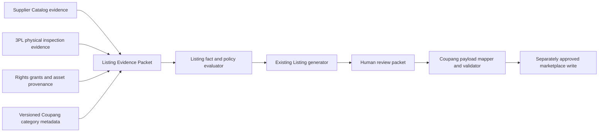

# Architecture Story: Listing Content Fact and Policy Contract v1

## 1. Decision status

- Status: proposed; repository-owner Architecture acceptance required.
- Story type: Architecture, contract, and test plan only.
- Owner: Listing domain, consuming Supplier / Procurement evidence and an owner-approved Coupang category contract.
- Baseline: `origin/main` at `a6572b08b637313a298ca14dd5d1c38ffeb9d874`.
- Delivery risk: normal-risk while the diff remains documentation-only.
- Runtime, API, database, migration, external integration, Production, and commerce changes: none.

This Story defines how listing content may later be generated. It does not approve an implementation, create or approve a Coupang listing, set a price, use a supplier image, or assert any fact about product `KK946`.

## 2. Business objective and revenue gate

The earliest blocked step for the first measurable sale is a reviewable, truthful listing packet for the selected physical product. The shortest safe next step is to define what evidence is sufficient before generating keywords, titles, images, detail content, product notices, and a Coupang payload. Adding another free-form generator would be faster only until an unsupported claim, rights violation, return, or category rejection blocks the sale.

Completion is measured by a later operator being able to distinguish, for each output claim, `PROVEN`, `UNKNOWN`, `CONFLICT`, and `PROHIBITED`, and by KK946 remaining quarantined until its evidence packet passes every required gate.

## 3. Current-state audit and root cause

Root-cause class: code and contract gap after external evidence readiness. No code may compensate for missing supplier, 3PL, rights, or Coupang category evidence.

### Existing boundaries to preserve

- `engines/listing/index.ts` already owns deterministic Listing draft rules.
- `services/listing.service.ts` already orchestrates Procurement, Workflow, `listing_drafts`, revisions, and status transitions.
- `shared/domain/listing.ts` already owns the current input/content types.
- migration `012_product_workspace_listing_ai.sql` already owns `listing_drafts` and `listing_draft_revisions`; this Story does not propose a duplicate table or migration.
- `SupplierCatalogService` and `SupplierCatalogPort` already expose normalized, read-only catalog facts. They do not prove rights or physical properties.
- the Item Selection contract already defines fail-closed resale and image rights gates. This Story consumes those decisions; it does not duplicate their policy.
- `types/coupang.ts` and `lib/coupang/validator.ts` define the current registration payload shape and validation boundary.
- `app/api/coupang/categories/meta/route.ts` and
  `lib/coupang/category.ts` already call Coupang's read-only category metadata
  endpoint. A later Story must audit and harden this boundary instead of adding
  a duplicate adapter.

### Confirmed defects and gaps

1. Listing engine, service, route, validator, and page contain broken Korean mojibake. The stored/generated text therefore cannot be presumed legible or reviewable.
2. Titles and keywords are simple combinations of product name, category, brand, and benefits. User input and defaults are treated as facts without provenance, freshness, conflict, or rights checks.
3. No image asset is generated. `thumbnailBrief` is only prose and neither proves an image exists nor grants a right to use or edit one.
4. The detail page is an array of outline sections. There is no rendered asset, measured layout, accessible text alternative, asset manifest, or visual QA.
5. `generateListingDraft` emits a generic `coupangPayload` containing fields such as `salePrice`, `categoryName`, `keywords`, and `options`, while the registration contract requires `displayCategoryCode`, sale dates, delivery and return fields, `vendorUserId`, and item-level images, attributes, contents, and prices. A generated draft is not registration-ready.
6. `listing_drafts` stores content and input snapshots but has no approved claim-to-evidence, image-rights, category-metadata, inspection, or quarantine contract. Schema changes are explicitly deferred.
7. Repository search found no authoritative KK946 catalog snapshot, 3PL inspection, category selection, product-notice data, image-rights grant, or approved image. `KK946` is an external business identifier only; all product facts remain `UNKNOWN` in this repository.
8. The manual registration page currently copies a candidate thumbnail URL,
   product name, price, and word-split search tags into a JSON draft. URL safety
   and syntactic validation do not prove image rights, product facts, category
   fitness, or registration readiness.

The backlog item “Listing content fact and policy contract” is therefore not a request to add a second Listing engine. It is the prerequisite contract for a later correction of the existing boundary.

## 4. Scope and non-goals

In scope:

- evidence vocabulary, precedence, conflicts, freshness, and quarantine;
- allowed inputs and outputs for title, keywords, image assets, detail page, product notices, and a registration-ready mapping;
- image-use/edit rights and prohibited claims;
- Coupang category-contract acquisition and binding;
- human review, observability, tests, rollout, and rollback;
- ordered implementation Stories with separate risk classification.

Non-goals:

- code, API, UI, worker, Queue, database, migration, RLS/Auth, or secret work;
- supplier/Coupang/3PL calls or uploads;
- image generation or editing;
- category selection, pricing, listing submission, or any Production write;
- asserting KK946 material, dimensions, composition, origin, certification, brand, compatibility, performance, contents, condition, or rights.

## 5. Ownership and dependency direction



The Listing domain owns claim admission, output derivation, quarantine, and the review packet. Supplier / Procurement owns normalized catalog and transaction evidence, not the truth of every supplier claim. The 3PL inspection producer owns observations of the identified received unit or lot. Rights evidence is authoritative only when issued by a verified rights holder or authorized grantor. The existing Coupang adapter owns category metadata acquisition and provider DTO translation. The Seller boundary alone owns a later live write.

Services orchestrate these contracts. The pure Listing policy must not access Supabase, HTTP, files, image generators, or Coupang. Routes and UI must not recalculate evidence status or convert `UNKNOWN` to a usable value.

## 6. Listing Evidence Packet

Every fact and asset reference has:

- `factId`, `subjectId`, and optional lot/unit identifier;
- normalized field and value with unit/locale where applicable;
- `sourceType`, `sourceReference`, `observedAt`, and `capturedAt`;
- evidence digest or immutable reference, never a raw secret/provider payload;
- `status`: `PROVEN | UNKNOWN | CONFLICT | PROHIBITED | NOT_APPLICABLE`;
- `scope`: catalog item, purchased SKU, inbound lot, inspected unit, or asset;
- freshness policy/result and reviewer when human verification is required.

`UNKNOWN` is a first-class value, not an empty string, zero, generic default, or model prompt. An LLM may summarize admitted facts but cannot create a fact, evidence reference, rights grant, category attribute, or PASS decision.

### Authority is fact-, scope-, and time-specific

There is no global “supplier first” or “3PL first” rule. The authoritative
source is selected by the fact being asserted, the exact item/variant/lot/unit
scope, and the observation/effective time.

| Fact class | Authoritative evidence | Corroborating evidence | Conflict rule |
|---|---|---|---|
| Supplier catalog identity, listed name, listed price/MOQ, and observed catalog availability | timestamped supplier catalog snapshot | supplier response | these remain catalog claims, not received-product facts |
| Agreed SKU/option, actual unit price, quantity, and transaction terms | accepted purchase order, invoice, or supplier confirmation bound to KK946 | earlier catalog snapshot | transaction evidence supersedes the earlier offer only for the identified transaction; identity mismatch quarantines |
| Received quantity, dimensions, weight, visible color/components/markings, and packaging condition | timestamped 3PL inspection tied to lot/unit and inspection method | supplier catalog claim | physical evidence applies only to inspected scope; mismatch is retained and quarantines dependent claims |
| Composition, origin, manufacturer, certification, safety, and warranty | competent registry, issuer, manufacturer, importer, or supplier document tied to exact SKU/variant | readable physical label and transaction evidence | appearance alone cannot prove regulated or documentary facts; inconsistent sources quarantine |
| Image use/edit permission | verified grant from rights holder or authorized grantor, bound to exact asset digest and intended operations | contract/order evidence that identifies the grant | silence, an image URL, or possession is `UNKNOWN`; conflict/prohibition blocks the asset |
| Coupang-required attributes, notices, documents, certifications, offer condition, and channel-specific expiry fields | fresh exact category metadata plus admitted product evidence | official category validity result and applicable official policy snapshot | missing/invalid category or required product fact blocks registration-ready output |

Physical evidence does not silently overwrite catalog history. Both values and their scopes remain visible. A conflict prevents any dependent claim until an authorized reviewer resolves it with new evidence. A sample unit never proves the entire lot unless the inspection protocol explicitly grants that scope.

## 7. KK946 quarantine packet

`KK946` is the first target identifier, but the repository currently contains no admissible evidence packet for it. Its initial contract state is:

```text
subjectId: KK946
identityBinding: UNKNOWN
supplierCatalogSnapshot: UNKNOWN
purchaseAndLotBinding: UNKNOWN
threePlInspection: UNKNOWN
imageUseRights: UNKNOWN
imageEditRights: UNKNOWN
coupangCategoryContract: UNKNOWN
productNoticeFacts: UNKNOWN
listingDisposition: QUARANTINED
```

Release from quarantine requires all of the following:

1. exact supplier item and ordered SKU/option are bound to KK946;
2. a relevant, fresh supplier catalog snapshot is retained;
3. received lot/unit identity and the required 3PL inspection are proven;
4. intended source assets have explicit marketplace-use and operation-specific edit rights, or independently created assets have provenance;
5. the exact Coupang display category and metadata version are approved;
6. every required attribute and product-notice field has admitted evidence;
7. every generated claim has a complete provenance graph;
8. encoding, asset, payload, policy, and human-review gates pass.

Missing evidence keeps KK946 quarantined. It does not authorize a placeholder listing, generic image, guessed notice, or live validation call.

## 8. Content contracts

### Titles

Titles are deterministic projections of admitted identity, brand, model, variant, quantity, and category-safe differentiators. Each token references one or more facts. Remove unsupported benefit, superlative, competitor, search-rank, certification, origin, material, compatibility, or performance language. `UNKNOWN` tokens are omitted; if a required identity token is unknown, title generation is quarantined. Enforce the exact category/provider length and forbidden-token rules from versioned metadata, not hard-coded assumptions.

### Search keywords

Keywords must be derived from admitted names, approved synonyms, measured category vocabulary, and proven use/compatibility facts. Deduplicate by normalized Korean/Latin form and retain `derivedFrom` references. Prohibit unowned brands, competitor marks, unrelated trending terms, hidden claims, medical/safety promises, and keyword stuffing. A simple word split or benefit concatenation is not a valid keyword policy.

### Images

An image output is an asset manifest, not a prompt. Each source and derivative records digest, dimensions, MIME type, provenance, subject/lot, creator, asserted rights holder, grantor identity and authority, grant evidence, use-right status, edit-right status, permitted channels, territory, term/expiry, revocation state, permitted transformations, right to provide the asset to Coupang/CDN processors, transformations, and reviewer.

- Supplier URLs alone grant no use or edit rights.
- `USE_ALLOWED` does not imply crop, background removal, text overlay, compositing, color change, or generative expansion.
- Supplier images with logos, watermarks, people, licensed characters, or third-party packaging remain quarantined unless the exact rights are proven.
- 3PL photographs are preferred for physical accuracy only when the inspection
  identity is proven and the photography agreement establishes the
  photographer/employer's authority, GonggamLine's marketplace-use/edit rights,
  and handling of people, labels, facility information, and personal data.
- Independent photography avoids relying on supplier-image copyright but does
  not clear third-party trademarks, trade dress, designs, characters, privacy,
  or publicity rights visible in the product or scene.
- Generative or editing tools require approved provider terms and a retained
  generation/transformation record. They may not supply missing product facts,
  clear third-party rights, or create a product representation from an
  unlicensed source asset.
- Generated or edited assets must not alter count, dimensions, color, components, included accessories, labels, certifications, or condition.
- Main-image and category-specific composition rules come only from the exact Coupang metadata/policy snapshot.

No derivative may be produced while either use or the intended edit operation is `UNKNOWN`, `CONFLICT`, or `PROHIBITED`.

### Detail page

The output is a rendered, versioned content package with ordered blocks, approved text, asset references, alt text, dimensions, and a review render. Every factual sentence and visual annotation is traceable. A section outline or LLM prose alone is not a detail page. Required visual QA checks legibility, cropping, mobile-width layout, encoding, count/variant consistency, notices, and absence of unsupported badges or claims.

### Product notices and required attributes

The product-notice contract is a field-level matrix keyed by exact Coupang category metadata version. Each field is `VALUE | LEGALLY_ALLOWED_NOT_APPLICABLE | UNKNOWN | CONFLICT | PROHIBITED` with provenance. “상세페이지 참조”, generic defaults, or a guessed “해당 없음” are forbidden unless that category field explicitly permits it and the reason is evidenced. Certification identifiers must be registry/document backed and must match the exact product/variant.

### No-exaggeration policy

The following require explicit, scoped evidence and applicable policy support: best/No.1, guaranteed outcomes, absolute safety, zero-risk, eco-friendly, antibacterial/medical effects, certified, domestic-made, authentic, exclusive, patented, comparative superiority, quantified durability/performance, review or sales rank, scarcity, and time-limited claims. Absence of evidence blocks the claim; hedging words do not legalize it. A model cannot infer benefits from an image, category, or supplier marketing copy.

## 9. Coupang category contract and payload boundary

Before content generation, bind a `CoupangCategoryContract` containing the exact `displayCategoryCode`, category status/validity result, provider metadata response hash and retrieval time, sales channel (`MARKETPLACE`, `ROCKET_GROWTH`, or an explicitly supported hybrid), required/allowed attributes, the operator-selected applicable `noticeCategoryName` and all of its detail fields, required documents, certification rules, allowed offer conditions, option constraints, and channel-specific distribution/expiry requirements. Category name text is not a category contract.

The contract consumes the existing read-only metadata boundary; it does not
authorize a second Coupang integration. The current `CoupangCategoryMeta =
Record<string, unknown>` and raw public error forwarding are audit findings,
not an accepted typed contract. A later compatibility Story must add validated
provider DTO mapping, sanitized failures, a category-validity read, and fixture
tests without changing the existing public response shape silently.

Coupang category metadata does not claim to own every content policy. Title,
search keyword, image, prohibited-product, advertising-expression, and other
seller rules that are absent from the metadata response belong in a separate
`MarketplacePolicySnapshot` made only from applicable current official policy
sources. The two snapshots are versioned and reviewed independently; neither
may invent a rule that its source does not contain.

Official evidence reviewed for this decision:

- [Coupang Category Metadata Query](https://developers.coupang.com/en/api?ref=legacy#categories): the exact category code returns attributes, notice categories, required documents, certifications, and allowed offer conditions; product creation must match the category metadata.
- [Coupang required notice FAQ](https://developers.coupang.com/ko/faq/there-is-an-error-that-says-check-required-product-info-cannot-find-legally-requ?ref=legacy): select the applicable notice category and provide all of its detail names.
- [Coupang notice-category selection FAQ](https://developers.coupang.com/ko/faq/there-are-several-notice-category-names-exposed-which-one-should-i-use?ref=legacy): one display category can expose multiple notice categories, so selection is a product-evidence decision rather than “use the first result.”

These URLs and the observation date (`2026-08-05`) are discovery evidence, not
a permanent cache. Exact metadata and applicable policies must be re-read at
approval/payload mapping because categories and requirements can change.

The later mapper must transform only an approved Listing packet into the existing `CoupangProductPayload`. It must supply and validate category code, dates, delivery/return data, vendor user, and item-level price, images, attributes, and contents from their owning contracts. Listing generation must not invent Seller configuration or pricing. The mapper returns either:

- `REGISTRATION_READY` with zero issues and exact evidence/category versions;
- `QUARANTINED` with stable, field-addressed issue codes.

The current generic `coupang_payload` is explicitly a legacy draft and must not be cast to or described as `CoupangProductPayload`.

## 10. State, approval, failure, and observability

Proposed content readiness states are `EVIDENCE_INCOMPLETE`, `QUARANTINED`, `GENERATED`, `REVIEWING`, `APPROVED_FOR_PAYLOAD_MAPPING`, and `REGISTRATION_READY`. They are contract concepts only; changing the persisted `listing_drafts.status` lifecycle requires a separate high-risk Database Story.

Any missing required evidence, conflict, prohibited right/claim, stale category contract, encoding failure, asset validation failure, or payload issue fails closed to quarantine. Retry means acquire or correct evidence, then create a new immutable evaluation. It never mutates history into PASS.

Human approval records reviewer, timestamp, evidence/category/ruleset digests, render digest, disposition, and unresolved non-blocking notes. Approval becomes stale when any bound digest or category metadata changes. Content approval is not listing submission authority.

Sanitized observability includes subject, evaluation ID, ruleset version, category contract digest, counts by evidence state, blocked field/claim codes, asset validation results, encoding result, and duration. Never log raw provider payloads, private rights documents, credentials, personal data, or binary assets.

## 11. Compatibility and deferred persistence

The later implementation must preserve current Listing read/write API response shapes until a separately approved versioned contract migrates consumers. Existing `listing_drafts` rows remain legacy drafts and are never backfilled as evidence-complete. They must be treated as unverified for registration-ready purposes.

No schema is approved here. If durable evidence packets, asset manifests, category snapshots, policy evaluations, or approval digests cannot be safely represented without overloading `generation_input`/`coupang_payload`, stop and write a separate Database/Security Architecture Story. Do not bury the new source of truth in unversioned JSON merely to avoid a migration review.

## 12. Test plan for later implementation

Pure policy and contract tests:

- every output token/claim maps to admitted evidence;
- missing facts remain `UNKNOWN` and required unknowns quarantine;
- catalog/3PL scope and conflicts follow the priority table;
- a sample observation does not become a lot-wide fact;
- use permission without edit permission blocks derivatives;
- prohibited logo/watermark/claim cases fail closed;
- mojibake, replacement characters, invalid UTF-8 round trips, and mixed normalization are rejected;
- keyword normalization/deduplication and trademark exclusions are deterministic;
- title/category limits and forbidden terms are metadata-version driven;
- notice `NOT_APPLICABLE` requires an allowed field and evidence reason;
- category version change invalidates approval;
- legacy draft never becomes registration-ready by type assertion;
- `CoupangProductPayload` mapping reports every missing required field;
- LLM output cannot introduce evidence, rights, numbers, or claim status.

Asset/render tests:

- digest, MIME, dimensions, file-size, channel, and transformation checks;
- image count/variant/components match physical evidence;
- rendered detail page has no missing assets, clipped text, mojibake, or unreadable mobile content and has meaningful alt text;
- golden review fixtures use synthetic/rights-cleared assets only.

Integration and negative tests:

- supplier catalog and 3PL evidence adapters are fake and deterministic;
- no real supplier, image model, Coupang, DB, or marketplace call in unit/CI;
- quarantine creates no Seller job and no live registration request;
- review digests detect stale evidence and asset replacement;
- public errors are stable and sanitized;
- existing Listing API behavior is covered during an explicit compatibility migration.

Delivery tests retain lint, typecheck, full unit/integration tests, production build, local safe browser validation, exact-head CI, exact Vercel Preview, and `preview-browser-e2e`. Preview must use synthetic or rights-cleared fixtures and must never create a listing, upload a Production asset, or claim to validate KK946 without its approved evidence packet.

## 13. Ordered implementation Stories

1. **KK946 evidence acquisition runbook and identity crosswalk**
   (documentation/read-only owner operation): first bind supplier item,
   purchased option, inbound lot, and inspected unit; collect catalog,
   transaction, 3PL, rights, and candidate-category evidence. This runs in
   parallel with Story 2 and never releases quarantine by itself.
2. **Evidence fixture and policy kernel** (normal-risk if pure types/tests): add
   immutable evidence/status types, authority/scope/conflict decisions,
   quarantine, encoding checks, and deterministic KK946-shaped synthetic
   fixtures. No DB/API change.
3. **Existing category metadata compatibility audit** (documentation and tests
   first): fixture-capture the current endpoint contract, provider fields,
   public response, and failures. Do not call the real provider in CI.
4. **Typed category and Marketplace Policy snapshots** (separate Architecture
   only where a public API/external contract changes): reuse the existing
   adapter, add validated mapping and category validity, and keep absent policy
   rules in the separate official-policy snapshot. Configuration remains
   separately approved.
5. **Rights-cleared source-asset and inspection-photo intake** (separate
   Architecture first): validate grantor authority, asset manifests, permitted
   channels/operations, privacy/trademark flags, retention, and visual QA
   inputs. No generation occurs in this Story.
6. **Listing generator v2 and rendered review packet** (normal-risk only if
   pure and backwards compatible): replace mojibake/default claims and simple
   joining; generate provenance-linked text and rights-cleared render artifacts
   behind a fail-closed compatibility boundary.
7. **Persistence and approval lifecycle** (high-risk/manual Architecture and
   implementation): only if durable evidence cannot use an already approved
   source of truth; define migration, RLS/Auth, immutable revisions, rollout,
   retention, and rollback.
8. **Coupang payload mapper compatibility** (high-risk if it affects listing or
   price flows): map the approved packet to the existing payload contract,
   validate offline/dry-run only, and prove quarantine cannot enqueue
   submission.
9. **One-product KK946 readiness review** (manual evidence decision): approve
   exact evidence/ruleset/category/policy/render digests. This still does not
   authorize a live listing.
10. **Separate live listing approval** (high-risk/manual): bind exact account,
    SKU, category, price, quantity, payload digest, rollback/stop procedure, and
    operator before a single marketplace write.

No Story may collapse these gates or use this document as authority for a DB, secret, paid, Production, price, or marketplace action.

## 14. Capacity, rollout, and rollback

Policy evaluation must be deterministic and bounded by configured limits on facts, claims, assets, sections, and issues; concrete limits are established from provider/category evidence in the implementation Story. No bulk catalog or image crawl is implied.

Rollout begins with offline fixtures and an unshippable quarantine UI, then rights-cleared Preview rendering, then payload mapping without submission. A later live action remains one explicitly approved product. Rollback reverts the relevant implementation while retaining immutable evidence and review history; never mark a legacy or rolled-back packet as approved.

For this documentation PR, rollback is a Git revert. It changes no runtime, database, provider, asset, or marketplace state.

## 15. Architecture and AI CTO compliance

- CTO directive: PASS. This is the smallest safe prerequisite to a truthful first listing and prohibits speculative platform work.
- Constitution: PASS. Sources of truth, fail-closed truthfulness, and human approval are explicit.
- Blueprint: PASS. Existing Listing, Supplier, Coupang, service, and domain boundaries are preserved; no duplicate engine/schema is implemented.
- Architecture review: PASS for this proposed documentation. Future new API, external integration, persistence, asset lifecycle, or listing write remains stopped until its own approved Story.
- Risk: normal-risk for this documentation-only diff. Later schema/Auth, pricing, configuration, paid, Production, or marketplace work is high-risk.

## 16. Owner decisions required

The repository owner must accept or amend:

1. the fact-specific supplier catalog/3PL precedence and conflict rule;
2. the image use/edit-rights gates and permitted evidence standard;
3. the exact category-contract requirement before content generation;
4. the ordered implementation sequence and separate high-risk boundaries.

Acceptance is a recorded owner decision with approved head SHA and date. A merge of this proposed document alone does not authorize implementation or a KK946 listing.
